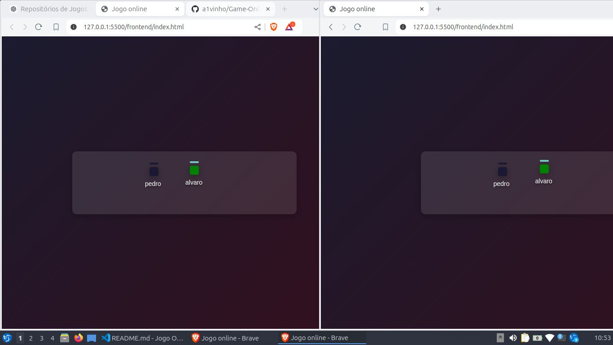
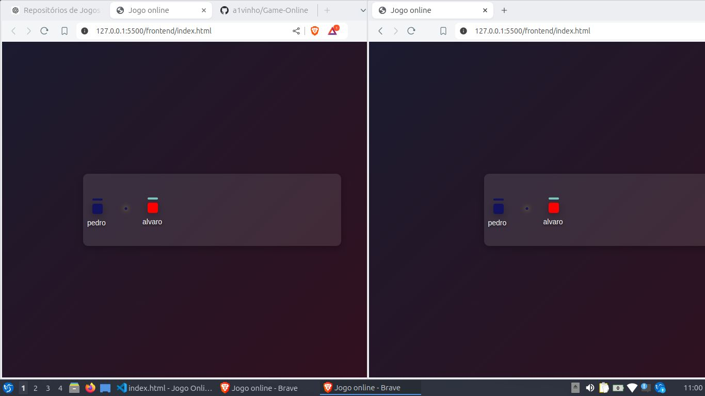

# Online Multiplayer Game

## Descrição

Este é um jogo online multiplayer simples onde os jogadores controlam retângulos que se movem e interagem em um ambiente compartilhado. O jogo é projetado para ser jogado em tempo real com outros jogadores.

## Tecnologias Utilizadas

- **HTML5** - Estrutura da interface do usuário.
- **CSS3** - Estilização e layout do jogo.
- **JavaScript** - Lógica de jogo no lado do cliente.
- **Node.js** - Servidor backend.
- **Socket.IO** - Comunicação em tempo real entre o cliente e o servidor.
- **Matter.js** - Motor de física para manipulação de colisões.

## Funcionalidades

- Movimento em tempo real dos jogadores na tela.
- Colisões físicas entre os retângulos dos jogadores.
- Sistema de notificações para novos jogadores que entram no jogo.

## Como Executar

1. Clone o repositório para sua máquina local.
2. Instale as dependências com `npm install`.
3. Inicie o servidor com `npm start`.
4. O servidor estára rodando em `http://localhost:8000`.

## Capturas de Tela

Abaixo estão algumas capturas de tela do jogo em ação:

## Contribuições

Contribuições são bem-vindas! Sinta-se à vontade para abrir um pull request ou relatar um problema.

## Licença

Este projeto é licenciado sob a [MIT License](LICENSE).
